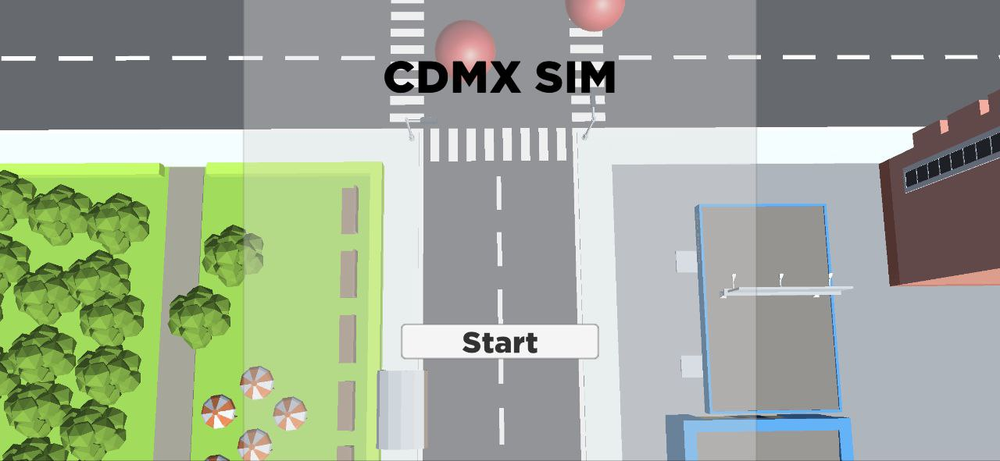

 # README.md

 This project contains the code for a Unity game and a Node.js server. The game is a simple traffic manager AR game where the player at an intersection must avoid crashing cars and creating a long queue that makes drivers mad. The server is used to host the car models so they can be downloaded at runtime using Asset Bundles.

 ## Prerequisites

 To run this project, you will need the following:

 * Unity 2022.3 or later
 * Node.js 16 or later
 * MySQL 8 or later

 ## Setup

 To set up the project, follow these steps:

 1. Clone the repository to your local machine.
 2. Open the project in Unity.
 4. Create a MySQL database with 2 fields, one for `demon_name` and `file_path`.
 5. Configure the database connection in the `config.js` file.
 6. Start the MySQL server.
 7. Run the command `npm install`. This installs all of the dependencies needed by the application.
 8. Get your local IP address and change it in line 73 in `index.js`.
 9. Start the Node.js server by running `node index.js`.
 10. In Unity, go to Assets in the top left corner and click on BuildAssetBundles.
 11. Open the file `UploadAssetBundle.cs` and change the IP to your local IP address obtained in step 8.
 12. Save the file and run the scene `UploadAssetBundle.unity`.
 13. Open the file `LevelManager.cs` and change the IP to your local IP address obtained in step 8.
 14. Build and run the Unity game on your phone without stopping the server.

 ## How to play

 To play the game, follow these steps:

 1. Print this image on a piece of paper.
 
 2. Use the game build on your phone to scan the image with your camera.
 3. If the image is scanned correctly, you should see a small menu like this.
 
 4. Press play.
 5. Click on the red spheres to make the cars move forward and prevent them from crashing.

 ## Code Explanation

 The code for this project is divided into two parts: the Unity game code and the Node.js server code.

 ### Unity Game Code

 The Unity game code is responsible for rendering the game world and handling the player's input. The main scripts in the game code are:

 * `CarController.cs`: This script makes the cars move forward, slowing down if they are too close to other cars on the same lane and stopping if the light is red.
 * `LaneManager.cs`: This script manages the lanes of traffic in the game.
 * `TrafficLightManager.cs`: This script controls the traffic lights in the game.
 * `MenuManager.cs`: This script manages the game's menus.

 ### Node.js Server Code

 The Node.js server code is responsible for hosting the game and managing the player's progress. The main files in the server code are:

 * `index.js`: This file starts the server and handles the game's requests.
 * `config.js`: This file contains the configuration for the server.

